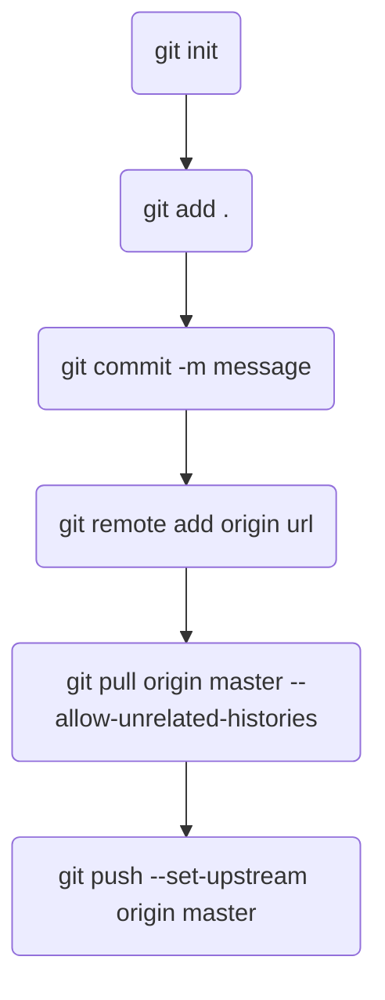
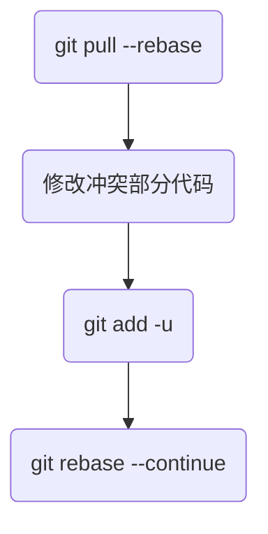
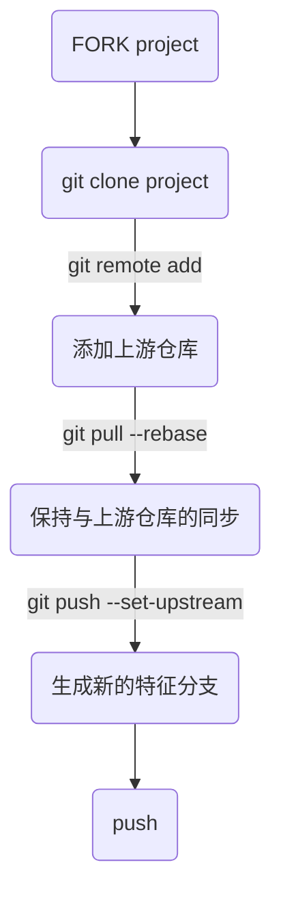

# 1、将本地仓库同步到远程



# 2、协同开发，解决冲突

```
> git branch
* new_feature
  dev
  
> git checkout dev

> git pull --rebase
## 如果与远程发生冲突
```

```
> git checkout new_feature
> git rebase dev
> git checkout dev
> git merge new_feature
> git push
```

# 3、pull request


