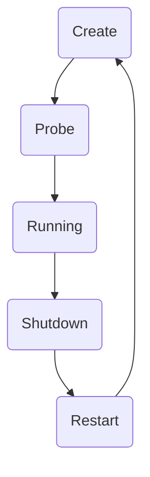

# 一、背景

`Kubernetes` 的依赖于目前的两大趋势：

- 容器技术 —— 资源隔离
- 微服务架构

# 二、架构设计


- Master
    - `API Server` : 处理来自用户的请求
    - `Controller Manager` : 管理控制器进程
    - `Scheduler` : 调度器，为 `Pod` 选择 `Node` 节点
- Node
    - `Kubelet` : 与 `API Server` 进行通信，管理 `Pod`
    - `Kube Proxy`: 管理宿主机的子网管理
    - `Pause`: 在 `Pod` 中作为 `Linux 命名空间` 共享的基础，启用 `PID命名空间` 共享，并收集僵尸进程

# 三、详解基本对象

`Kubernetes` 中四大基本对象：

- `Pod`
- `Service`
- `Volume`
- `Namespace`

## 1、Pod

`Pod` 是 `Kubernetes` 集群中的基本单元，其中有以下基本概念：

### 1.1 容器

每一个 `Kubernetes` 的 `Pod` 中存在两种不同的容器：

- `InitContainer`: 初始化配置
- `Container`: 应用容器

### 1.2 卷

每一个 `Pod` 中的容器可以通过卷共享文件目录，卷能够持久化存储数据，且当 `Pod` 出现故障或者滚动更新时，卷中的数据不会清除。

### 1.3 网络

同一个 `Pod` 中的多个容器共享网络栈，即多个容器可以通过 `localhost` 互相访问到彼此的端口和服务。同一个 `Pod` 中的所有容器连接到同一个网络设备，即 `pause` 容器。

### 1.4 生命周期



## 2、Service

由于 `Pod` 存在服务漂移的可能性，如果用 `PodIP` 对外提供服务，就很有可能随着服务漂移而无法提供服务，所以建立了 `Service` 的概念，为提供同一服务的 `Pod` 建立一个抽象。

在集群中 `Kube-proxy` 根据 `Service` 的创建和删除修改运行代理的配置，为节点内的客户端提供流量的转发和负载均衡等功能，目前默认使用 `ipvs` 作为代理模式。

## 3、Volume

`Kubernetes` 目前支持多种 `Volume`：

- Volume
- Persistent Volume: 作为有状态服务的存储方式
- Dynamic Volume Provisioning: 允许存储卷按需进行创建


`Volume` 的使用时经历的操作：

1. Attach(附着)
2. Mount(挂载)
3. Unmount(卸载)
4. Detach(分离)

如果使用 `EmptyDir`、 `HostPath` 这种类型的 `Volume`，不会经历附着和分离的操作。

### 各种 Volume 的使用方式

#### (1) Volume

```
apiVersion: v1
kind: Pod
metadata:
  name: test-pod
spec:
  containers:
  - name: test
    image: test.com/test
    volumeMounts:
    - name: cache-volume
      mountPath: /cache
    - name: test-volume
      mountPath: /hostpath
    - name: config-volume
      mountPath: /data/configmap
    - name: special-volume
      mountPath: /data/secret
  volumes:
  - name: cache-volume
    emptyDir: {}
  - name: hostpath-volume
    hostPath:
      path: /data/hostpath
      type: Directory
  - name: config-volume
    configMap:
      name: special-config
  - name: secret-volume
    secret:
      secretName: secret-config
```

> 其中 `ConfigMap` 和 `Secret` 并不会随着 `Pod` 的销毁而删除，其他对象会随着 `Pod` 的销毁而删除。

`Volume` 的主要主要作用是容器对数据进行同步和共享

#### (2) Persistent Volume

要让数据能够持久化，首先就需要将 `Pod` 和 `Volume` 的声明周期分离，于是引入了持久卷 `PersistentVolume(PV)` ，与其一同被引入的概念还有 `PersistentVolumeClaim(PVC)`。两者的关系如下：

```
   PV      Node
    |       |
    |   vs  |
    v       v
   PVC     Pod
```

`PersistentVolumeClaim(PVC)` 消耗 `PersistentVolume(PV)` 的资源。


`PersistentVolume(PV)` 的访问模式

- `ReadWriteOnce`: 表示当前卷可以被一个节点使用读写模式挂载
- `ReadOnlyMany`: 表示当前卷可以被多个节点使用只读模式挂载
- `ReadWriteMany`: 表示当前卷可以被多个节点使用读写模式挂载


`PersistentVolume(PV)` 的回收策略

- Retain: 保留
- Delete: 删除
- dynamic provisioning: 动态提供

## 4、ReplicaSet

维持一组 `Pod` 副本的运行，保证一定数量的 `Pod` 在集群中正常运行。

常用 [`Deployments`](https://kubernetes.io/docs/concepts/workloads/controllers/deployment/) 替换 [`ReplicaSet`](https://kubernetes.io/docs/concepts/workloads/controllers/replicaset/)，`Deployment` 在 `ReplicaSet` 实现了滚动升级。

