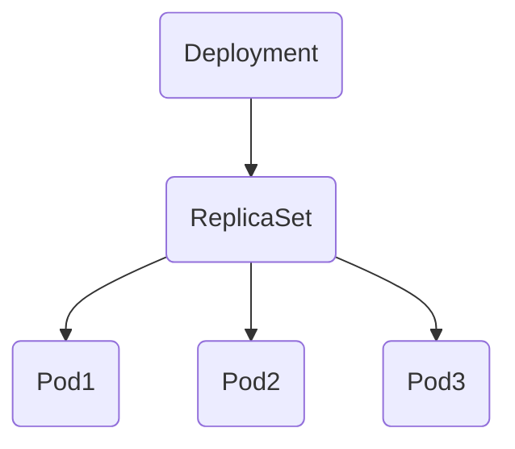
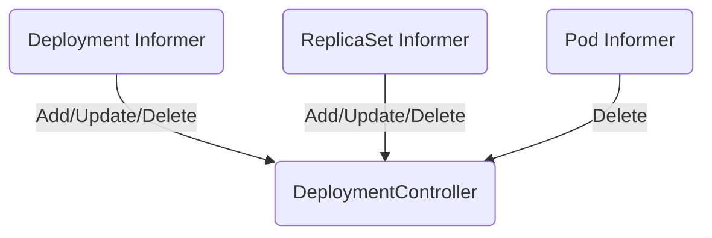

# Deployment

## 1. 简介

例如如下的部署文件：

```
apiVersion: apps/v1
kind: Deployment
metadata:
  name: nginx-deployment
  labels:
    app: nginx
spec:
  replicas: 3
  selector:
    matchLabels:
      app: nginx
  template:
    metadata:
      labels:
        app: nginx
    spec:
      containers:
      - name: nginx
        image: nginx:1.7.9
        ports:
        - containerPort: 80
```

当我们在 `Kubernetes` 集群中创建上述 `Deployment` 对象时，它不只会创建 `Deployment` 资源，还会创建另外的 `ReplicaSet` 以及三个 `Pod` 对象：

```
$ kubectl get deployments.apps
NAME               READY     UP-TO-DATE   AVAILABLE   AGE
nginx-deployment   3/3       3            3           6m55s

$ kubectl get replicasets.apps
NAME                          DESIRED   CURRENT   READY     AGE
nginx-deployment-76bf4969df   3         3         3         7m27s

$ kubectl get pods
NAME                                READY     STATUS    RESTARTS   AGE
nginx-deployment-76bf4969df-58gxj   1/1       Running   0          7m42s
nginx-deployment-76bf4969df-9jgk9   1/1       Running   0          7m42s
nginx-deployment-76bf4969df-m4pkg   1/1       Running   0          7m43s
```

每一个 `Deployment` 都会和它的依赖组成以下的拓扑结构:



## 2. DeploymentController

所有的 `Deployment` 对象都是由 `Controller Manager` 集群中的 `DeploymentController` 进行管理。

`DeploymentController` 作为管理 `Deployment` 资源的控制器，会在启动时通过 `Informer` 监听三种不同资源的通知：`Pod`、`ReplicaSet` 和 `Deployment`，这三种资源的变动都会触发 `DeploymentController` 中的回调。


