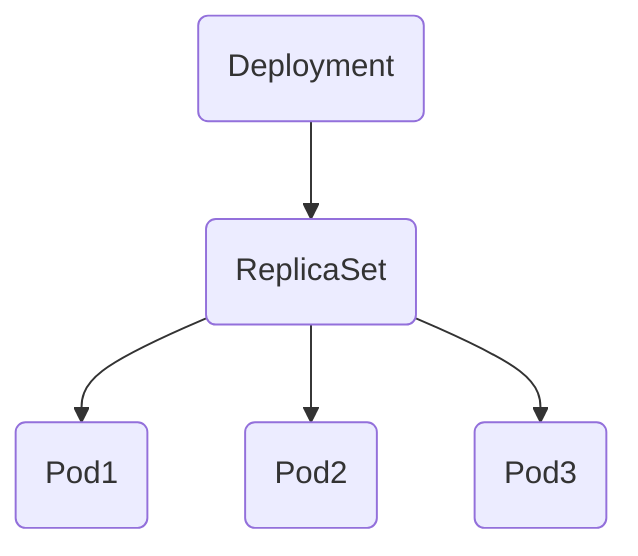
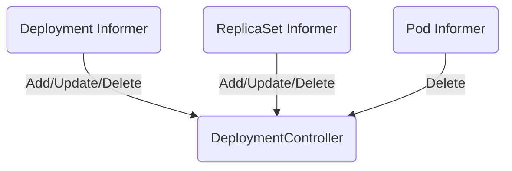
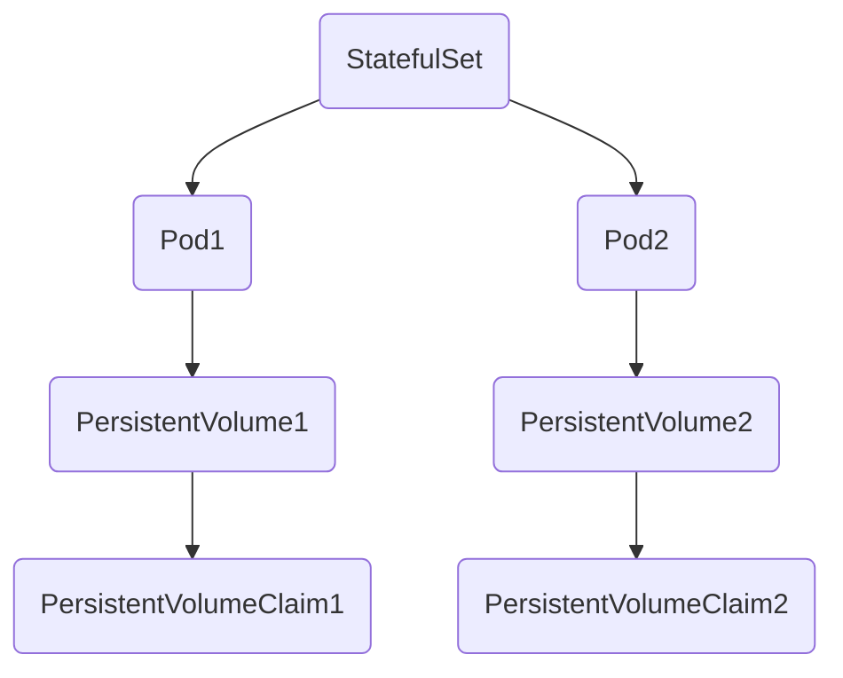
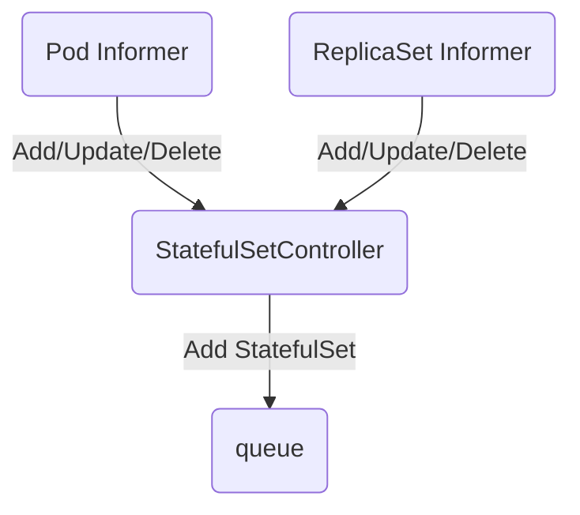

# Deployment

## 1. 简介

例如如下的部署文件：

``` yaml
apiVersion: apps/v1
kind: Deployment
metadata:
  name: nginx-deployment
  labels:
    app: nginx
spec:
  replicas: 3
  selector:
    matchLabels:
      app: nginx
  template:
    metadata:
      labels:
        app: nginx
    spec:
      containers:
      - name: nginx
        image: nginx:1.7.9
        ports:
        - containerPort: 80
```

当我们在 `Kubernetes` 集群中创建上述 `Deployment` 对象时，它不只会创建 `Deployment` 资源，还会创建另外的 `ReplicaSet` 以及三个 `Pod` 对象：

``` bash
$ kubectl get deployments.apps
NAME               READY     UP-TO-DATE   AVAILABLE   AGE
nginx-deployment   3/3       3            3           6m55s

$ kubectl get replicasets.apps
NAME                          DESIRED   CURRENT   READY     AGE
nginx-deployment-76bf4969df   3         3         3         7m27s

$ kubectl get pods
NAME                                READY     STATUS    RESTARTS   AGE
nginx-deployment-76bf4969df-58gxj   1/1       Running   0          7m42s
nginx-deployment-76bf4969df-9jgk9   1/1       Running   0          7m42s
nginx-deployment-76bf4969df-m4pkg   1/1       Running   0          7m43s
```

每一个 `Deployment` 都会和它的依赖组成以下的拓扑结构:



## 2. DeploymentController

所有的 `Deployment` 对象都是由 `Controller Manager` 集群中的 `DeploymentController` 进行管理。

`DeploymentController` 作为管理 `Deployment` 资源的控制器，会在启动时通过 `Informer` 监听三种不同资源的通知：`Pod`、`ReplicaSet` 和 `Deployment`，这三种资源的变动都会触发 `DeploymentController` 中的回调。



# StatefulSet

## 1. 简介

`StatefulSet` 是用于管理有状态应用的工作负载对象，不仅能管理 `Pod` 的对象，还它能够保证这些 `Pod` 的顺序性和唯一性。

例如如下的部署文件：

``` yaml
apiVersion: apps/v1
kind: StatefulSet
metadata:
  name: web
spec:
  serviceName: "nginx"
  replicas: 2
  selector:
    matchLabels:
      app: nginx
  template:
    metadata:
      labels:
        app: nginx
    spec:
      containers:
      - name: nginx
        image: k8s.gcr.io/nginx-slim:0.8
        volumeMounts:
        - name: www
          mountPath: /usr/share/nginx/html
  volumeClaimTemplates:
  - metadata:
      name: www
    spec:
      accessModes: [ "ReadWriteOnce" ]
      resources:
        requests:
          storage: 1Gi
```

如果我们在 `Kubernetes` 集群中创建如上所示的 `StatefulSet` 对象，会得到以下结果：

``` bash
$ kubectl get statefulsets.apps
kNAME   READY   AGE
web    2/2     2m27s

$ kubectl get pods
NAME    READY   STATUS    RESTARTS   AGE
web-0   1/1     Running   0          2m31s
web-1   1/1     Running   0          105s

$ kubectl get persistentvolumes
NAME                                       CAPACITY   ACCESS MODES   RECLAIM POLICY   STATUS   CLAIM               STORAGECLASS       REASON   AGE
pvc-19ef374f-39d1-11e9-b870-9efb418608da   1Gi        RWO            Delete           Bound    default/www-web-1   do-block-storage            21m
pvc-fe53d5f7-39d0-11e9-b870-9efb418608da   1Gi        RWO            Delete           Bound    default/www-web-0   do-block-storage            21m

$ kubectl get persistentvolumeclaims
NAME        STATUS   VOLUME                                     CAPACITY   ACCESS MODES   STORAGECLASS       AGE
www-web-0   Bound    pvc-fe53d5f7-39d0-11e9-b870-9efb418608da   1Gi        RWO            do-block-storage   21m
www-web-1   Bound    pvc-19ef374f-39d1-11e9-b870-9efb418608da   1Gi        RWO            do-block-storage   21m
```

两个 `Pod` 对象名中包含了它们的序列号，该序列号会在 `StatefulSet` 存在的时间内保持不变，哪怕 `Pod` 被重启或者重新调度，也不会出现任何的改变。



## 2. StatefulSetController

`StatefulSetController` 会同时从 `PodInformer` 和 `ReplicaSetInformer` 中接受增删改事件并将事件推送到队列中。



# DaemonSet

## 1. 简介

`DaemonSet` 可以保证集群中所有的或者部分的节点都能够运行同一份 `Pod` 副本，每当有新的节点被加入到集群时，`Pod` 就会在目标的节点上启动，如果节点被从集群中剔除，节点上的 `Pod` 也会被垃圾收集器清除；`DaemonSet` 的作用就像是计算机中的守护进程，它能够运行集群存储、日志收集和监控等『守护进程』，这些服务一般是集群中必备的基础服务。

例如如下的部署文件：

``` yaml
apiVersion: apps/v1
kind: DaemonSet
metadata:
  name: fluentd-elasticsearch
  namespace: kube-system
spec:
  selector:
    matchLabels:
      name: fluentd-elasticsearch
  template:
    metadata:
      labels:
        name: fluentd-elasticsearch
    spec:
      containers:
      - name: fluentd-elasticsearch
        image: k8s.gcr.io/fluentd-elasticsearch:1.20
        volumeMounts:
        - name: varlog
          mountPath: /var/log
        - name: varlibdockercontainers
          mountPath: /var/lib/docker/containers
          readOnly: true
      volumes:
      - name: varlog
        hostPath:
          path: /var/log
      - name: varlibdockercontainers
        hostPath:
          path: /var/lib/docker/containers
```

在 `Kubernetes` 集群的 `kube-system` 命名空间中创建 `DaemonSet` 资源并在所有的节点上创建新的 `Pod`：

``` bash
$ kubectl get daemonsets.apps fluentd-elasticsearch --namespace kube-system
NAME                    DESIRED   CURRENT   READY   UP-TO-DATE   AVAILABLE   NODE SELECTOR   AGE
fluentd-elasticsearch   1         1         1       1            1           <none>          19h

$ kubectl get pods --namespace kube-system --label name=fluentd-elasticsearch
NAME                          READY   STATUS    RESTARTS   AGE
fluentd-elasticsearch-kvtwj   1/1     Running   0          19h
```

## 2. DaemonSetsController

用于管理 `DaemonSet` 的控制器是 `DaemonSetsController`，该控制器会监听 `DaemonSet`、`ControllerRevision [版本信息]`、`Pod` 和 `Node` 资源的变动。

```mermaid
    graph LR;
        DaemonSetsController -.-> Worker;
        DaemonSetsController -.-> Worker;
        DaemonSetsController -.-> Worker;
        Queue --> Worker;
        Queue --> Worker;
        Queue --> Worker;
        DaemonSet Informer --> Queue;
        ControllerRevision --> Queue;
        Pod Informer --> Queue;
        Node Informer --> Queue;
```