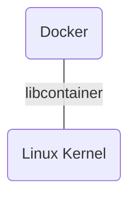

# 一、 RunC(OCI-runtime)

`RunC` 是 `a lightweight, portable container runtime.`，是 docker 公司在 `libcontainer` 基础之上的封装实现。

> `libtainer` is a Docker interface to Linux facilities like Cgroups, namespaces, netlink and netfilter.




当创建一个容器时，分这么几步：

1. `Docker engine` 创建 `image`，并把它推到 `containerd`
2. `containerd` 调用 `containerd-shim`
3. `containerd-shim` 调用 `RunC` 运行容器
4. `RunC` 启动完容器后本身会直接退出, `containerd-shim` 则会成为容器进程的父进程, 负责收集容器进程的状态, 上报给 `containerd`, 并在容器中 `pid` 为 1 的进程退出后接管容器中的子进程进行清理, 确保不会出现僵尸进程


这个模型的优势：

- Running daemon-less containers
- The ability to restart or upgrade engine without breaking the running containers

# 二、 Docker Network

## （一）Docker Networking architecture


在 Docker1.7 版本中，网络部分代码就已经被抽离并单独成为了 Docker 的网络库，即 `libnetwork`。在此之后，容器的网络模式也被抽像变成了统一接口的驱动。为了标准化网络的驱动开发步骤和支持多种网络驱动，Docker公司在 `libnetwork` 中使用了 `CNM（Container Network Model）`。`CNM` 定义了构建容器虚拟化网络的模型。同时还提供了可以用于开发多种网络驱动的标准化接口和组件。

## （二）CNM 核心组件

1. Sandbox: A Sandbox contains the configuration of a container's network stack.
2. Endpoint: An Endpoint joins a Sandbox to a Network.
3. Network: A Network is a collection of endpoints that have connectivity between them.

## （三）CNM 驱动接口

- Network Driver
    + Native Network Drivers
        - Host
        - Bridge
        - Overlay
        - MACVLAN
        - None
    + Remote Network Drivers
        - contiv
        - weave
        - calico
        - kuryr
- IPAM Driver

## （四）查询 Docker Network

``` bash
# 查看网关
$ ifconfig

# 查看静态路由
$ route -n

# iptables 用于 Docker 容器和容器之间以及和外界的通信
$ iptables-save
# Generated by iptables-save v1.4.21 on Thu Apr 11 18:45:08 2019
*nat # 网络
:PREROUTING ACCEPT [118404:5494260]
:INPUT ACCEPT [118404:5494260]
:OUTPUT ACCEPT [134203:9698715]
:POSTROUTING ACCEPT [158541:11146592]
:DOCKER - [0:0]
-A PREROUTING -m addrtype --dst-type LOCAL -j DOCKER
-A OUTPUT ! -d 127.0.0.0/8 -m addrtype --dst-type LOCAL -j DOCKER
-A POSTROUTING -s 172.18.0.0/16 ! -o docker0 -j MASQUERADE     # POSTROUTING 是源地址转换，要把你的内网地址转换成公网地址
-A POSTROUTING -s 172.18.0.2/32 -d 172.18.0.2/32 -p tcp -m tcp --dport 15672 -j MASQUERADE
-A POSTROUTING -s 172.18.0.2/32 -d 172.18.0.2/32 -p tcp -m tcp --dport 5672 -j MASQUERADE
-A DOCKER -i docker0 -j RETURN
-A DOCKER ! -i docker0 -p tcp -m tcp --dport 15672 -j DNAT --to-destination 172.18.0.2:15672
-A DOCKER ! -i docker0 -p tcp -m tcp --dport 5672 -j DNAT --to-destination 172.18.0.2:5672
COMMIT
# Completed on Thu Apr 11 18:45:08 2019
# Generated by iptables-save v1.4.21 on Thu Apr 11 18:45:08 2019
*filter # 过滤
:INPUT ACCEPT [998660:247636610]
:FORWARD DROP [0:0]
:OUTPUT ACCEPT [1138927:585842087]
:DOCKER - [0:0]
:DOCKER-ISOLATION-STAGE-1 - [0:0]
:DOCKER-ISOLATION-STAGE-2 - [0:0]
:DOCKER-USER - [0:0]
-A FORWARD -j DOCKER-USER
-A FORWARD -j DOCKER-ISOLATION-STAGE-1
-A FORWARD -o docker0 -m conntrack --ctstate RELATED,ESTABLISHED -j ACCEPT
-A FORWARD -o docker0 -j DOCKER
-A FORWARD -i docker0 ! -o docker0 -j ACCEPT
-A FORWARD -i docker0 -o docker0 -j ACCEPT
-A DOCKER -d 172.18.0.2/32 ! -i docker0 -o docker0 -p tcp -m tcp --dport 15672 -j ACCEPT
-A DOCKER -d 172.18.0.2/32 ! -i docker0 -o docker0 -p tcp -m tcp --dport 5672 -j ACCEPT
-A DOCKER-ISOLATION-STAGE-1 -i docker0 ! -o docker0 -j DOCKER-ISOLATION-STAGE-2
-A DOCKER-ISOLATION-STAGE-1 -j RETURN
-A DOCKER-ISOLATION-STAGE-2 -o docker0 -j DROP
-A DOCKER-ISOLATION-STAGE-2 -j RETURN
-A DOCKER-USER -j RETURN
COMMIT
# Completed on Thu Apr 11 18:45:08 2019
```